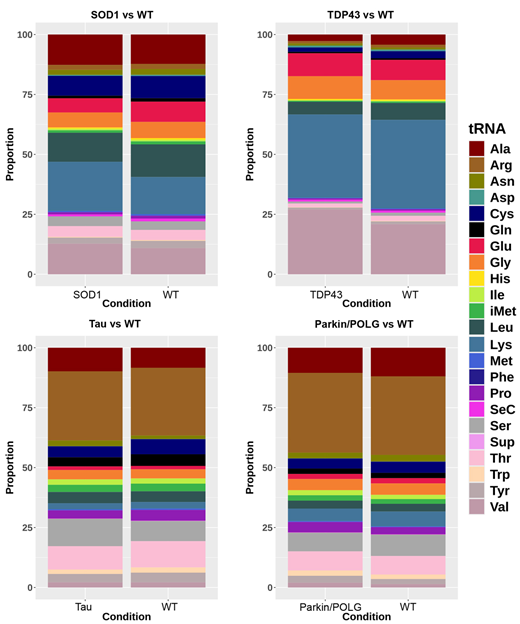
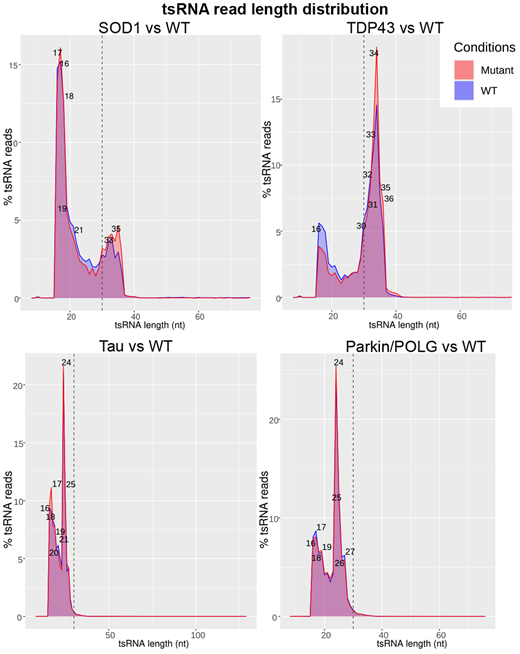
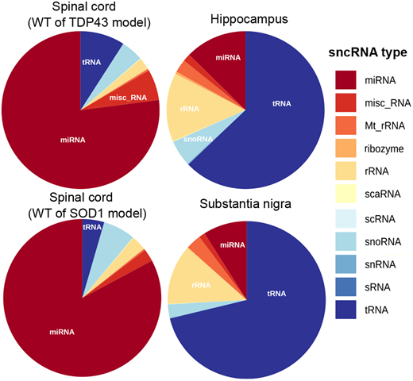
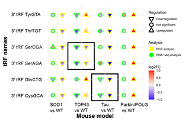
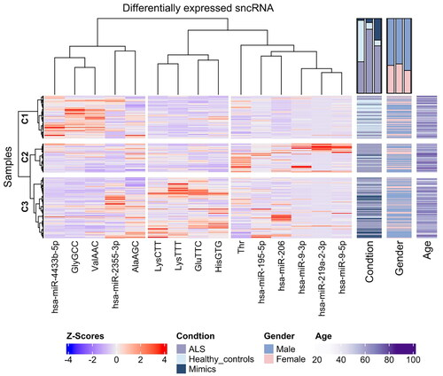
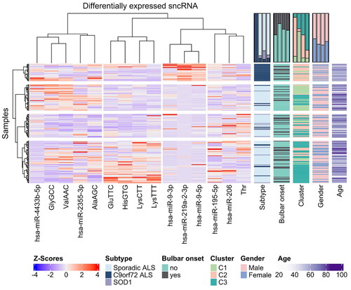
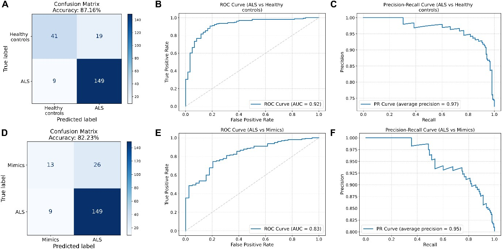

Demonstrated Data Science Skills

Basic Exploratory Data Analysis and Visualization

|  |  |
|:--:|:--:|
| **Stacked Bar Plot** | **Line Plot** |

|  |  |
|:--:|:--:|
| **Piechart** | **Bubble Plot** |

---

Clustering

|  |  |
|:--:|:--:|
| **Clustering Result 1** | **Clustering Result 2** |

---

Classification

---

### 💡 Notes
- All figures are from published works demonstrating exploratory data analysis, clustering, and classification.
- DOI: https://doi.org/10.1242/dmm.050870 & https://doi.org/10.1080/21678421.2025.2574690
- Click images to view them in full size.
